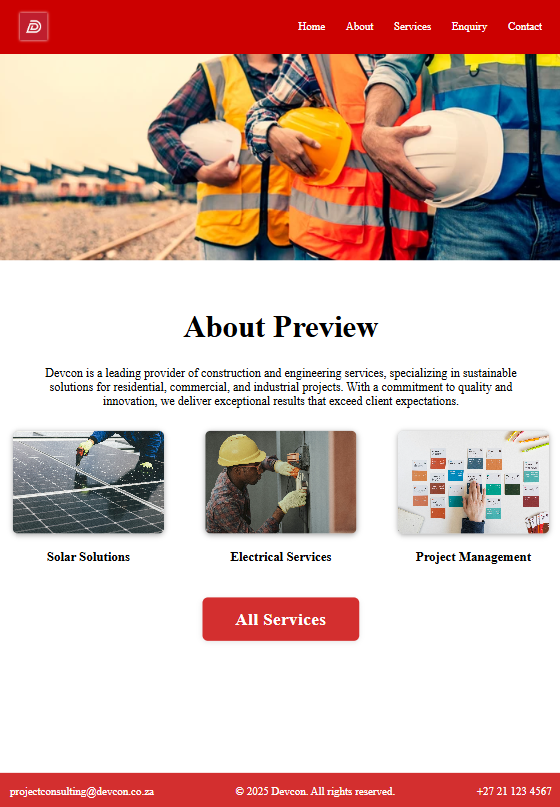
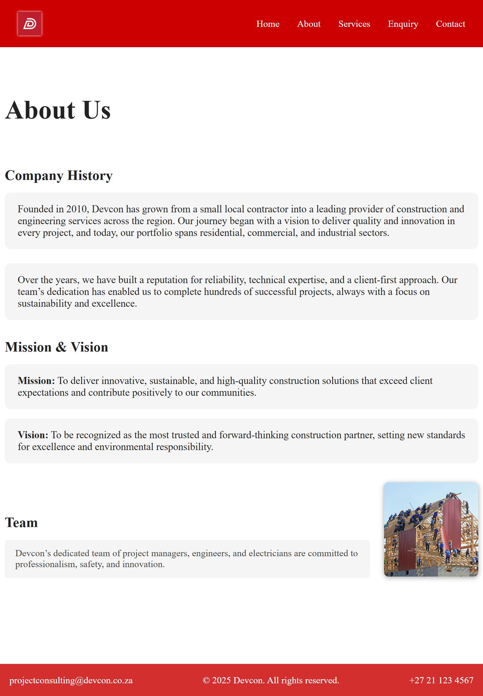
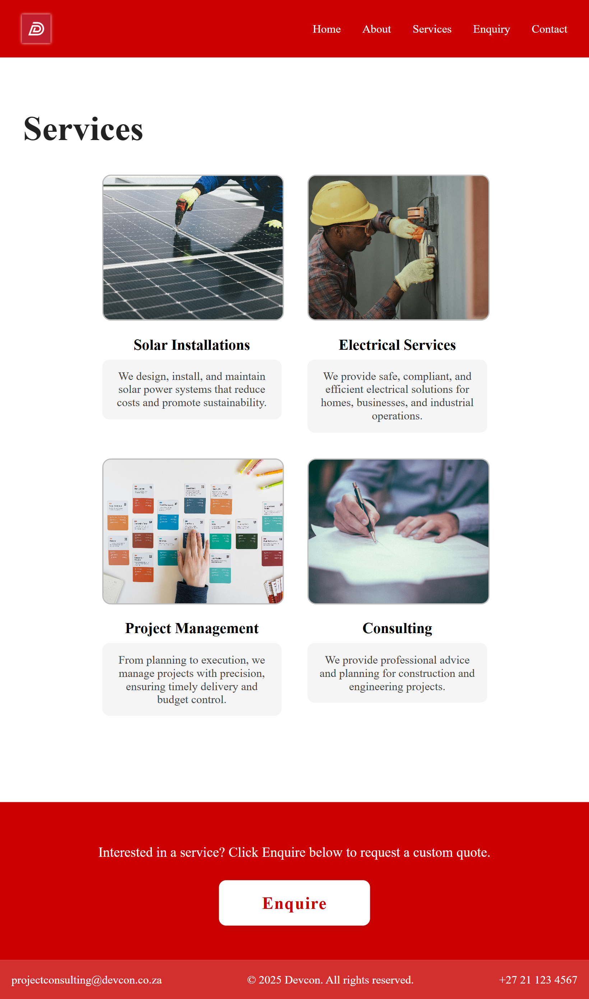
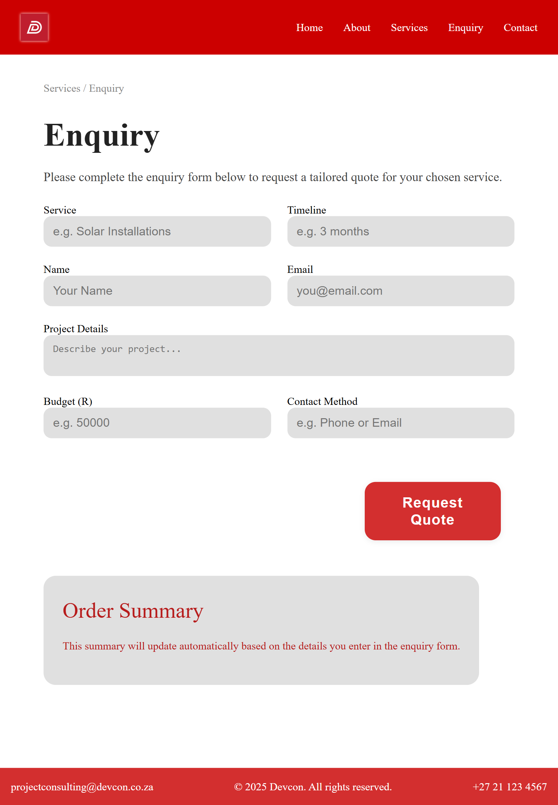
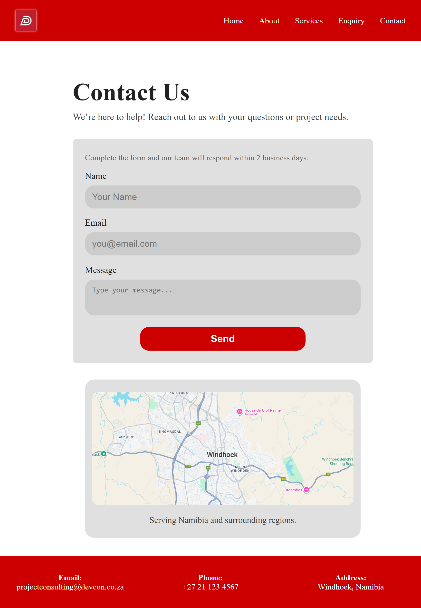

# Devcon Website Project  

## Project Title  
Devcon Company Website  

## Student Information  
- **Name:** [Your Full Name]  
- **Student Number:** [Your Student Number]  
- **Course:** WEDEMM  
- **Institution:** Varsity College  

## Project Overview  
Devcon is a South African business specialising in project management, electrical installations, contract management, and solar energy solutions. This project involves the creation of a responsive, professional website to establish Devcon’s online presence, showcase services, and provide clients with an enquiry platform.  

The website includes:  
- Home  
- About Us  
- Services  
- Enquiry  
- Contact  

## Website Goals and Objectives  
- Establish Devcon’s digital presence.  
- Highlight services and past experience.  
- Provide a structured enquiry form for quotes.  
- Improve client communication.  
- Ensure responsive design across devices.  

## Key Features and Functionality  
- **Home Page:** Hero banner, company overview, service previews.  
- **About Us:** Company history, mission & vision, team section.  
- **Services:** Solar, Electrical, Project Management, and Consulting.  
- **Enquiry:** Form with service selector, timeline, budget, and order summary.  
- **Contact:** Contact details, form, and embedded location map.  

## Content Licensing  
- **Unsplash**: Images used for services and content sections, licensed under the free Unsplash License (commercial and non-commercial use permitted).  
- **Shutterstock**: Banner image licensed under the Shutterstock Royalty-Free License.  
- **Figma**: Used for wireframes and interface design mockups.  
- **Google Fonts**: Used under the SIL Open Font License.  

## Timeline and Milestones  
- **Week 1:** Research, content gathering, and wireframes.  
- **Week 2:** Base design created with HTML/CSS, content integrated.  
- **Week 3:** Enquiry form, responsiveness, and interactivity.  
- **Week 4:** Testing, breakpoints adjustments, and final deployment.  

## Breakpoints Testing  
Screenshots demonstrate responsive design tested on smaller breakpoints (e.g., iPad/tablet screens). Layout and styling remain intact without major distortions.  

### Examples:  
- **Homepage on Tablet**  
  

- **About Us Page on Tablet**  
  

- **Services Page on Tablet**  
  

- **Enquiry Page on Tablet**  
  

- **Contact Page on Tablet**  
  

*(Screenshots uploaded in the `/screenshots/` folder of the project.)*  

## Changelog  
- **v1.0 (Initial Submission):** Project setup, content research, wireframes, README created.  
- **v1.1 (Part 2 Submission):** Licensing details added, footer corrected, external stylesheet implemented, CSS styling applied (base, typography, layout, and visual styles), responsive testing performed.  

## References  
Figma. (2025) *Figma: The collaborative interface design tool*. Available at: https://www.figma.com (Accessed: 27 August 2025).  

Varsity College. (2025) *WEDE5020MM Module Manual*. Cape Town: Varsity College (Accessed: 27 August 2025).  

Unsplash. (2025) *Free stock photos and images under the Unsplash License*. Available at: https://unsplash.com (Accessed: 29 September 2025).  

Shutterstock. (2025) *Royalty-free images, photos, and vectors*. Available at: https://www.shutterstock.com (Accessed: 29 September 2025). Licensed under Shutterstock Royalty-Free License.  
